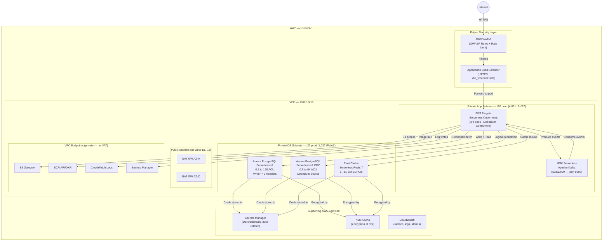
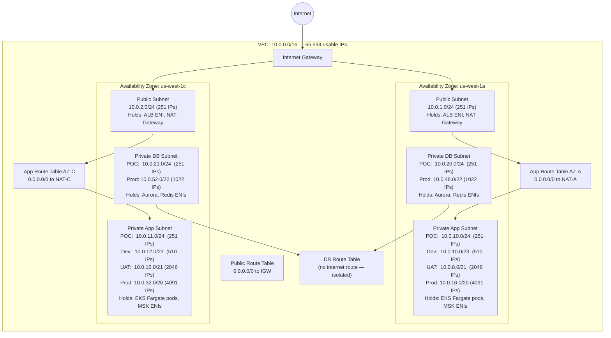
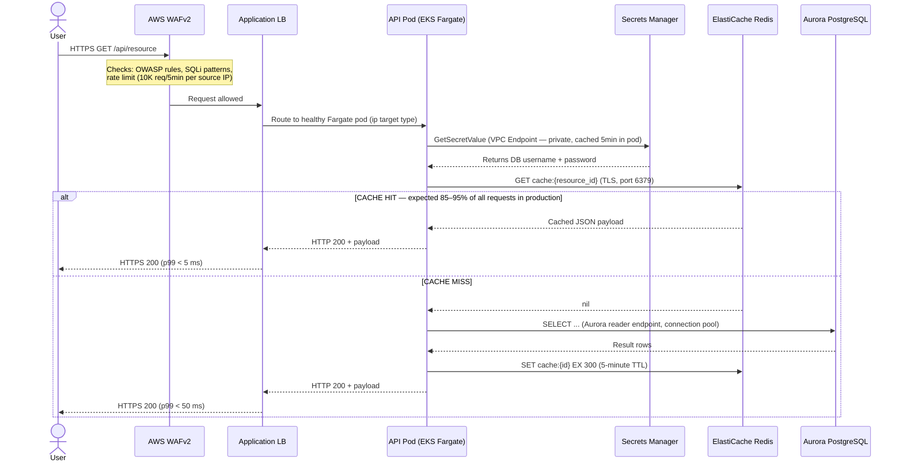
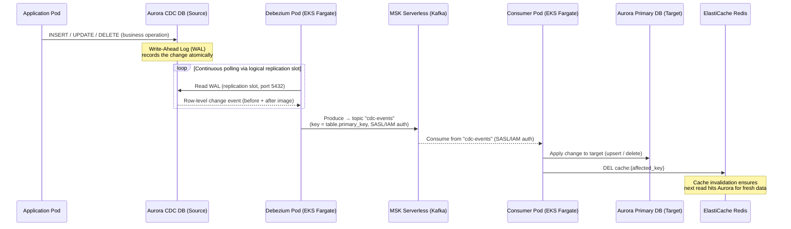
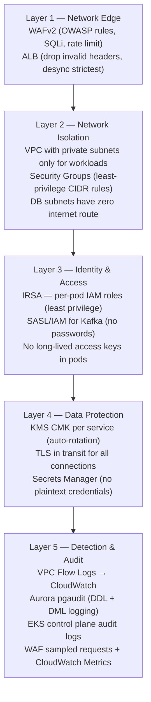
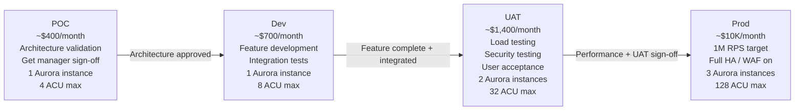

# Cultech Platform — Full Architecture & Deployment Guide

> **Document status:** Draft for manager approval  
> **Prepared by:** Platform Engineering Team  
> **Cloud Provider:** AWS (Region: `us-west-1` — N. California)  
> **Terraform version:** ≥ 1.5.0 · AWS Provider `~> 5.0`

---

## Table of Contents

1. [Executive Summary](#1-executive-summary)
2. [High-Level Architecture Overview](#2-high-level-architecture-overview)
3. [Network Topology](#3-network-topology)
4. [Service Architecture](#4-service-architecture)
5. [Data Flow — User Request Path](#5-data-flow--user-request-path)
6. [Data Flow — CDC Event Pipeline](#6-data-flow--cdc-event-pipeline)
7. [Security Architecture](#7-security-architecture)
8. [Observability & Monitoring](#8-observability--monitoring)
9. [Major Architectural Decisions](#9-major-architectural-decisions)
10. [Environment Strategy — POC → Dev → UAT → Prod](#10-environment-strategy--poc--dev--uat--prod)
11. [Cost Estimation](#11-cost-estimation)
12. [Scalability Analysis — Path to 1 Million RPS](#12-scalability-analysis--path-to-1-million-rps)
13. [Deployment Guide (Step-by-Step)](#13-deployment-guide-step-by-step)
14. [Infrastructure File Reference](#14-infrastructure-file-reference)

---

## 1. Executive Summary

The **Cultech Platform** is a fully serverless, cloud-native data platform on AWS designed to handle up to **1,000,000 HTTP requests per second** in production.

Every compute and data service is **serverless** — meaning AWS manages all capacity,
patching, and scaling automatically. The team pays only for what is consumed, and the
platform scales from near-zero (POC) to 1 M RPS (production) using the **same Terraform
codebase** with a single variable-file change.

### What this infrastructure creates

| Layer | AWS Service | Purpose |
|---|---|---|
| Edge / Security | AWS WAFv2 + Application Load Balancer | DDoS protection, rate-limiting, HTTPS termination |
| Compute | Amazon EKS Fargate | Serverless Kubernetes — no EC2 nodes to manage |
| Streaming | Amazon MSK Serverless | Managed Apache Kafka for event-driven pipelines |
| Primary Database | Aurora PostgreSQL Serverless v2 | Main transactional DB, auto-scales 0.5 → 128 ACU |
| CDC Database | Aurora PostgreSQL Serverless v2 (CDC) | Source DB with logical replication for Debezium CDC |
| Cache | ElastiCache Serverless Redis 7 | Session store + hot-data cache (1 TB / 5 M ECPU/s in prod) |
| Networking | VPC + Subnets + NAT + VPC Endpoints | Isolated private network, zero-cost S3/ECR/Logs routing |

### Key business value

- **Zero server management** — no EC2 patching, no node scaling, no OS maintenance
- **Cost-proportional** — starts at ~$400/month (POC) and scales elastically to millions of users
- **One codebase, four environments** — POC → Dev → UAT → Prod via a single `-var-file` flag
- **Enterprise security** — WAF, KMS encryption at rest, Secrets Manager, VPC private networking,
  per-pod IAM via IRSA

---

## 2. High-Level Architecture Overview



---

## 3. Network Topology

### 3.1 VPC and Subnet Layout



### 3.2 Traffic paths through the network

| Traffic type | Route | Goes through NAT? |
|---|---|---|
| User HTTPS request → App pod | Internet → IGW → ALB (Public) → Pod (Private App) | No |
| Pod → ECR (image pull) | Pod → ECR Interface VPC Endpoint | **No (free, private)** |
| Pod → S3 | Pod → S3 Gateway VPC Endpoint | **No (free, private)** |
| Pod → Secrets Manager | Pod → Secrets Manager VPC Endpoint | **No (private)** |
| Pod → CloudWatch Logs | Pod → CloudWatch Logs VPC Endpoint | **No (private)** |
| Pod → Other AWS APIs | Pod → NAT GW → Internet | Yes ($0.045/GB) |

> The four VPC Endpoints eliminate NAT data-transfer charges for the highest-volume paths.
> At 1 M RPS, ECR pulls + CloudWatch log writes can reach 500 GB/day — saving ~$700/month.

---

## 4. Service Architecture

### 4.1 AWS WAFv2 — Web Application Firewall

- **Scope:** Regional, attached directly to the ALB
- **Enabled:** UAT + Prod only (controlled by `alb_enable_waf` variable)

| Priority | Rule Name | Action |
|---|---|---|
| 10 | AWS Managed Core Rule Set (OWASP Top 10) | None (log only in POC/Dev; block in Prod) |
| 20 | AWS Managed Known Bad Inputs Rule Set | None / Block |
| 30 | AWS Managed SQLi Rule Set | None / Block |
| 40 | Rate-based: > 10,000 req per 5 min per IP | **Block** |

- All WAF metrics are published to CloudWatch for visibility and alerting.

---

### 4.2 Application Load Balancer (ALB)

- **Multi-AZ** — spans both Public Subnets (us-west-1a and us-west-1c)
- HTTP (port 80) → HTTP 301 redirect to HTTPS when SSL certificate is provided
- HTTPS (port 443) → Forward to EKS target group (type = `ip`, required for Fargate)
- `drop_invalid_header_fields = true` — HTTP request smuggling protection
- `desync_mitigation_mode = "strictest"` — HTTP desync attack protection
- `idle_timeout = 120s` (UAT/Prod) — handles long-lived API + Server-Sent Events connections
- Access logs → S3 bucket with 90-day lifecycle expiry

---

### 4.3 Amazon EKS Fargate — Serverless Kubernetes

- **No EC2 worker nodes** — every pod runs in an AWS-managed, dedicated Fargate micro-VM
- **IRSA** (IAM Roles for Service Accounts) — each pod type gets a scoped IAM role via OIDC;
  no node-level credentials
- **Security Groups for Pods (SGP)** — VPC CNI `ENABLE_POD_ENI=true` gives each Fargate
  pod its own ENI in the app subnet; downstream services use CIDR-based SG rules

**Fargate Profiles (namespaces that run on Fargate):**

| Profile | Namespace(s) | Purpose |
|---|---|---|
| `apps` | `default`, `production`/`poc`/`dev`/`uat`, `kube-system` | API pods + system components |
| `debezium` | `debezium` | Debezium CDC connector pods |
| `monitoring` | `monitoring` | Prometheus + Grafana (UAT/Prod) |

- Control-plane logs (`api`, `audit`, `authenticator`, `controllerManager`, `scheduler`) stream to CloudWatch

---

### 4.4 Amazon MSK Serverless — Apache Kafka

- **No broker instances** — fully managed; AWS scales throughput and storage automatically
- **Authentication:** SASL/IAM only, port 9098 — no password/SCRAM
- Pods authenticate using their **IRSA role** (IAM policy grants MSK produce/consume)
- Accessible **only from the Private App subnets** (CIDR-based Security Group rule)
- Application-defined topics: `db-events`, `cdc-events`, `notification-events`

---

### 4.5 Aurora PostgreSQL Serverless v2 — Primary Database

- **Engine mode:** `provisioned` + `serverlessv2_scaling_configuration` (AWS's current serverless mode)
- **Instance class:** `db.serverless` — auto-scales between `min_capacity_units` and `max_capacity_units`
- **1 ACU = 2 GiB RAM + proportional CPU**
- **Topology:** 1 writer + N readers; all readers share the same storage (no replication lag)
- **Auto-scaling:** Application Auto Scaling scales reader count (1–10) based on CPU utilisation
- **Encryption:** KMS CMK, key rotation enabled, 30-day deletion window (prod)
- **Credentials:** Auto-generated password in Secrets Manager; never stored in Terraform state
- **Backup:** 30-day continuous automated backup + final snapshot on deletion
- **Performance Insights:** 731-day retention in production
- **Enhanced Monitoring:** 1-second granularity (prod)
- **Parameter Group settings:** `pg_stat_statements`, `pgaudit`, DDL query logging, slow query log (> 1 s)

---

### 4.6 Aurora PostgreSQL Serverless v2 — CDC Source (Debezium)

Same serverless v2 setup as the primary database, plus these CDC-specific PostgreSQL parameters:

| Parameter | Value | Reason |
|---|---|---|
| `rds.logical_replication` | `1` | Enables WAL logical replication (required for Debezium) |
| `max_wal_senders` | `10` | Up to 10 simultaneous replication connections |
| `max_replication_slots` | `10` | Up to 10 Debezium connector instances |
| `wal_sender_timeout` | `0` | Prevents WAL sender from timing out on slow consumers |
| `rds.force_ssl` | `1` | All connections require TLS |

Debezium reads the PostgreSQL **Write-Ahead Log (WAL)** via a logical replication slot and publishes
row-level change events to MSK Kafka topics in near-real-time (sub-second latency).

---

### 4.7 ElastiCache Serverless Redis 7

- **No cluster nodes** — AWS provisions ECPU and storage on demand
- **Dual endpoints:** Primary (read/write) + Reader (read-only for horizontal read scale)
- **ECPU/s** (ElastiCache Processing Units per second): AWS billing unit; 1 simple GET/SET ≈ 1–3 ECPU
- **Encryption:** TLS in transit + KMS CMK at rest
- **No auth_token** — network-layer auth via Security Group (only app-subnet CIDRs can reach port 6379)
- **Daily snapshot:** 05:00 UTC, 7-day retention in prod
- **CloudWatch Alarms:**
  - `BytesUsedForCache > 80% of max_data_storage_gb` → SNS alert
  - `ElastiCacheProcessingUnits > 80% of max_ecpu_per_second` → SNS alert

---

## 5. Data Flow — User Request Path



### Response latency targets

| Scenario | p50 | p99 | p99.9 |
|---|---|---|---|
| Cache HIT | < 1 ms | < 5 ms | < 10 ms |
| Cache MISS (Aurora read) | < 10 ms | < 50 ms | < 100 ms |
| Write (Aurora writer) | < 5 ms | < 20 ms | < 50 ms |
| End-to-end (WAF + ALB + Pod) | +2 ms | +5 ms | +10 ms |

---

## 6. Data Flow — CDC Event Pipeline

The **Change Data Capture (CDC)** pipeline uses Debezium to capture every row-level change in
the source database and publish it as an event to Apache Kafka. Downstream consumer pods
apply those changes to the primary database and invalidate the Redis cache in near-real-time.



### CDC pipeline characteristics

| Attribute | Value |
|---|---|
| Replication format | Logical (row-level, pgoutput plugin) |
| Average lag | Sub-second (typically < 200 ms) |
| Delivery guarantee | At-least-once (Debezium + Kafka) |
| Message ordering | Per-partition; partition key = table primary key |
| Failure handling | Dead-letter topic after 3 retries |
| Kafka auth method | SASL/IAM (pod IRSA role, no passwords) |
| Replication slots | Up to 10 (one per Debezium connector instance) |

---

## 7. Security Architecture

### 7.1 Defence in Depth



### 7.2 Security Group Rules

| Security Group | Inbound port/protocol | Source | Purpose |
|---|---|---|---|
| `alb-sg` | 80, 443 (TCP) | `0.0.0.0/0` | Internet → ALB |
| `eks-pods-sg` | 1025–65535 (TCP) | `alb-sg` | ALB → Fargate pods |
| `eks-pods-sg` | All (self) | `eks-pods-sg` | Pod-to-pod communication |
| `msk-sg` | 9098 (SASL/IAM) | App subnet CIDRs | Fargate pods → MSK |
| `aurora-sg` | 5432 (PostgreSQL) | App subnet CIDRs | Fargate pods → Aurora |
| `rds-sg` (CDC) | 5432 (PostgreSQL) | App subnet CIDRs | Debezium pods → CDC RDS |
| `elasticache-sg` | 6379 (Redis) | App subnet CIDRs | Fargate pods → Redis |

> **CIDR-based SG rules** are required for MSK/Aurora/Redis because EKS Fargate pods with
> Security Groups for Pods are identified by their ENI source IP (subnet CIDR), not a fixed
> Security Group ID at the time of connection.

### 7.3 Encryption at Rest (KMS)

| Service | KMS Key ID | Rotation | Deletion window |
|---|---|---|---|
| Aurora Primary | `{name}-aurora-kms` | Annual (auto) | 30d (prod) / 7d (POC) |
| Aurora CDC | `{name}-rds-kms` | Annual (auto) | 30d (prod) / 7d (POC) |
| ElastiCache Redis | `{name}-redis-kms` | Annual (auto) | 30d (prod) / 7d (POC) |
| S3 (ALB Logs) | SSE-S3 (AES-256) | N/A | N/A |
| Secrets Manager | AWS managed key | N/A | Account-level |

### 7.4 Credentials — How passwords never appear in code

```
1. Terraform random_password resource generates a 32-character random password.
2. Terraform writes it directly to AWS Secrets Manager — never to .tfvars or state.
3. Fargate pods call Secrets Manager at startup via VPC Endpoint (private, no NAT).
4. The secret ARN is passed between Terraform and the application via EKS ConfigMap / ENV var.
5. AWS Secrets Manager auto-rotates the secret (configurable; Terraform sets the rotation Lambda hook).
```

---

## 8. Observability & Monitoring

| What is monitored | Where it lives | Retention |
|---|---|---|
| VPC Flow Logs (all VPC traffic) | CloudWatch Logs: `/aws/vpc/{env}/flow-logs` | POC: 7d · Prod: 90d |
| EKS control-plane logs | CloudWatch Logs: `/aws/eks/{cluster}/cluster` | 30 days |
| ALB access logs | S3: `{name}-alb-access-logs/alb-logs/` | 90-day S3 lifecycle |
| WAF sampled requests + blocked counts | CloudWatch Metrics (WAF namespace) | 14 days |
| Aurora Enhanced Monitoring | CloudWatch Metrics (RDS namespace) | Prod: 1-second granularity |
| Aurora Performance Insights (query analysis) | RDS console + API | Prod: 731 days (2 years) |
| Aurora pgaudit logs (DDL/DML audit) | CloudWatch Logs | 30 days |
| Redis `BytesUsedForCache > 80%` | CloudWatch Alarm → SNS | — |
| Redis `ElastiCacheProcessingUnits > 80%` | CloudWatch Alarm → SNS | — |

---

## 9. Major Architectural Decisions

### Decision 1 — Fully Serverless Architecture

**Problem:** EC2/RDS require capacity planning, patching windows, and manual scaling rules.  
**Decision:** Every layer is serverless: EKS Fargate, MSK Serverless, Aurora Serverless v2, ElastiCache Serverless.  
**Result:** Zero server management. Scales from $400/month (POC, 1 pod) to $15,000/month (prod, 1 M RPS)
using exactly the same Terraform code.

---

### Decision 2 — EKS Fargate with Security Groups for Pods

**Problem:** Fargate pods don't run on EC2 node groups, so traditional node-level security groups
don't work for pod-level traffic.  
**Decision:** Enable VPC CNI `ENABLE_POD_ENI=true` (via EKS addon configuration) so each pod gets
its own ENI. Downstream SGs (Aurora, MSK, Redis) use CIDR rules against the app subnet range.  
**Result:** Network-layer pod isolation without exposing a shared node SG.

---

### Decision 3 — SASL/IAM for MSK (No Kafka Passwords)

**Problem:** MSK Serverless does not support SCRAM/username-password authentication.  
**Decision:** Use SASL/IAM as the only auth mechanism. Each Debezium/consumer pod has an IRSA role
with an IAM policy granting MSK produce or consume on specific topics.  
**Result:** Zero Kafka credential management. Access control is enforced by IAM, which is audited by CloudTrail.

---

### Decision 4 — Dedicated CDC Cluster with Logical Replication

**Problem:** Enabling logical replication on the primary application Aurora cluster would consume
WAL sender slots and add WAL write amplification, impacting latency for the main app.  
**Decision:** Provision a **separate** Aurora Serverless v2 cluster exclusively for Debezium, with a
custom cluster parameter group that enables `rds.logical_replication=1`.  
**Result:** Debezium CDC workload is isolated from the primary application DB. Both clusters scale independently.

---

### Decision 5 — VPC Endpoints (S3, ECR, CloudWatch, Secrets Manager)

**Problem:** All traffic from private Fargate pods to AWS services (ECR image pulls, log writes,
S3 writes, Secrets Manager) would otherwise traverse NAT Gateways at $0.045/GB.  
**Decision:** Provision one S3 Gateway Endpoint (free) and three Interface Endpoints ($0.01/hr each).  
**Result:** At 1 M RPS, ECR + CloudWatch traffic easily reaches 500 GB/day.
VPC Endpoints save ~$700/month at that scale while also improving security (traffic never leaves the VPC).

---

### Decision 6 — Per-Environment Isolated Terraform State

**Problem:** A shared state file means a failed `terraform apply` in dev could corrupt production state.  
**Decision:** Each environment (`poc`, `dev`, `uat`, `prod`) has its own S3 key in the shared state bucket.
The `backend.tf` uses **partial configuration** — the bucket/key are injected via
`-backend-config=environments/{env}-backend.hcl` at `terraform init` time.  
**Result:** Complete blast-radius isolation per environment. Destroying POC can never affect production.

---

### Decision 7 — Zero Hardcoded Values in the Root Module

**Problem:** Hardcoded values (timeouts, retention periods, instance counts) make the codebase
environment-specific and require source-code edits to promote to the next environment.  
**Decision:** Every configurable value is a Terraform `variable`. Environment-specific values live
exclusively in `environments/{env}.tfvars`. The root `main.tf` has zero hardcoded strings or numbers.  
**Result:** Promoting from POC to Prod is:
```bash
terraform plan -var-file=environments/prod.tfvars
```
No source code changes. No risk of forgetting to update a hardcoded value.

---

## 10. Environment Strategy — POC → Dev → UAT → Prod

### Promotion lifecycle



### Environment comparison

| Setting | POC | Dev | UAT | Prod |
|---|---|---|---|---|
| Goal | Validate architecture | Feature dev | Load test + UAT | Live 1M RPS |
| Monthly cost | ~$400 | ~$700 | ~$1,400 | ~$10,000 |
| NAT Gateways | 1 | 1 | **2 (HA)** | **2 (HA)** |
| App subnet size | /24 (251 IPs) | /23 (510 IPs) | /21 (2,046 IPs) | /20 (4,091 IPs) |
| EKS API public | Yes | Yes | **No** | **No** |
| WAF | Off | Off | **On** | **On** |
| Aurora instances | 1 | 1 | 2 | 3 |
| Aurora max ACU | 4 | 8 | 32 | 128 |
| CDC RDS max ACU | 2 | 4 | 16 | 64 |
| Redis max ECPU/s | 10,000 | 50,000 | 500,000 | 5,000,000 |
| Redis max storage | 10 GB | 20 GB | 100 GB | 1,000 GB |
| Backup retention | 1 day | 7 days | 14 days | 30 days |
| Performance Insights | 7 d (free) | 7 d (free) | 7 d (free) | 731 d (2 yr) |
| Enhanced monitoring | 60s | 30s | 5s | **1s** |
| KMS deletion window | 7 days | 7 days | 14 days | 30 days |
| ALB deletion lock | Off | Off | **On** | **On** |

---

## 11. Cost Estimation

> All prices: **AWS us-west-1 (N. California)**, April 2026. Usage-dependent items marked `†`.

### 11.1 POC — ~$345–$500/month

| Service | Configuration | Monthly (~USD) |
|---|---|---|
| VPC + NAT Gateway (×1) | $0.045/hr × 730hr + ~50 GB data | ~$47 |
| Application Load Balancer | Base $0.008/hr + LCU | ~$30 |
| EKS Control Plane | 1 cluster × $0.10/hr × 730hr | ~$73 |
| EKS Fargate compute | ~5 pods × 0.25 vCPU × 512 MB RAM | ~$15 † |
| MSK Serverless | ~1 cluster unit × $0.09/hr | ~$65 † |
| Aurora Serverless v2 (Primary) | 1 instance, avg 1 ACU, I/O + storage | ~$35 † |
| Aurora Serverless v2 (CDC) | 1 instance, avg 0.5 ACU, I/O + storage | ~$20 † |
| ElastiCache Serverless Redis | 10 GB storage, 10K ECPU/s | ~$25 † |
| VPC Interface Endpoints (×3) + S3 | 3 × $0.01/hr × 730hr | ~$22 |
| CloudWatch Logs + Metrics | Minimal data ingestion | ~$10 |
| S3 (ALB logs + TF state) | < 1 GB | ~$2 |
| KMS (3 CMKs × $1/month) | 3 keys | ~$3 |
| Secrets Manager (3 secrets) | 3 × $0.40/month | ~$2 |
| **Estimated Total** | | **~$349–$500** |

---

### 11.2 Dev — ~$600–$800/month

| Change from POC | Details | Delta |
|---|---|---|
| Aurora Primary up to 8 ACU | More development queries | +$25 |
| CDC RDS up to 4 ACU | CDC testing | +$10 |
| Redis 20 GB, 50K ECPU/s | Integration test caching | +$15 |
| Fargate ~20 pods | Dev workloads | +$30 |
| Backup retention 7 days | More snapshots stored | +$5 |
| Monitoring interval 30s | More metrics data points | +$5 |
| **Estimated Total** | | **~$610–$800** |

---

### 11.3 UAT — ~$1,200–$1,600/month

| Change from Dev | Details | Delta |
|---|---|---|
| 2nd NAT Gateway | HA pair in both AZs | +$35 |
| WAF enabled | $25 base + request-based | +$80 † |
| Aurora 2 instances, 32 ACU max | Load test DB performance | +$100 † |
| CDC RDS 2 instances, 16 ACU max | HA test | +$60 † |
| Redis 100 GB, 500K ECPU/s | Load test caching | +$150 † |
| EKS Fargate ~50 pods | Load test capacity | +$100 † |
| MSK higher throughput | Load test Kafka | +$100 † |
| **Estimated Total** | | **~$1,235–$1,600** |

---

### 11.4 Prod — ~$8,000–$15,000/month

| Service | Configuration | Monthly (~USD) |
|---|---|---|
| NAT Gateways (×2) | 2 × $0.045/hr + data transfer | ~$200 † |
| ALB (at 1M RPS) | Base + ~500K+ LCU-hours/month | ~$2,000 † |
| WAFv2 (at 1M RPS) | $25 + $1/M requests × 2.6B/month | ~$2,625 † |
| EKS Control Plane | 1 cluster | ~$73 |
| EKS Fargate (~500 pods) | 500 × 1 vCPU × 2 GB avg | ~$1,500 † |
| MSK Serverless (high throughput) | Heavy Kafka produce/consume | ~$800 † |
| Aurora Primary (3 inst, 128 ACU) | Write + 2 readers, high I/O | ~$1,500 † |
| Aurora CDC (2 inst, 64 ACU) | Debezium continuous replication | ~$400 † |
| ElastiCache Serverless (1 TB, 5M ECPU/s) | 1 TB data + 5M ECPU/s peak | ~$1,800 † |
| VPC Endpoints (×4) | 4 × $0.01/hr × 730hr | ~$29 |
| CloudWatch (high volume) | Logs ingestion + metrics + alarms | ~$300 † |
| Performance Insights (731d) | 3 Aurora instances × extended retention | ~$150 |
| S3 (logs + state) | ALB access log data | ~$50 † |
| Data Transfer | Intra-AZ + NAT outbound | ~$500 † |
| KMS + Secrets Manager | 3 keys + 3 secrets | ~$10 |
| **Estimated Total** | | **~$8,000–$15,000** |

### 11.5 Cost optimisation recommendations

| Recommendation | Potential Saving |
|---|---|
| **Add CloudFront CDN** in front of ALB in prod | Move WAF to edge PoPs; reduce ALB LCUs by 60–80% for cacheable content; save ~$2,000/month |
| **Fargate Spot** for non-critical pods (batch consumers, monitoring) | Up to 70% cost reduction on Fargate compute |
| **Aurora Savings Plans** after 12 months of stable ACU usage | 30–40% reduction on ACU cost |
| **Redis cache-hit ratio > 90%** | Each 5% improvement in hit rate reduces Aurora ACU by ~5 ACU avg, saving ~$150/month |
| **POC teardown after sign-off** | Stop paying $400/month when POC is no longer needed |
| **Dev/UAT schedule shutdowns** | Non-prod environments don't need 24/7; stopping Aurora instances outside business hours can save 30–50% |

---

## 12. Scalability Analysis — Path to 1 Million RPS

### 12.1 Capacity analysis per layer

| Layer | Bottleneck metric | Capacity configured | Utilisation at 1M RPS |
|---|---|---|---|
| WAFv2 | Request inspection rate | Unlimited (AWS managed) | ~0% (no hard limit) |
| ALB | LCU throughput | Unlimited (charged per LCU) | ~$2,000/month |
| EKS Fargate | Pod count | Thousand of pods | ~500 pods |
| MSK Serverless | Throughput units | Auto-scales to millions msg/s | ~5–10% |
| Aurora write | 1 writer, 128 ACU | ~200,000 writes/s at 128 ACU | ~5–20% |
| Aurora read | 10 readers, 128 ACU each | ~1M reads/s combined | ~10–15% |
| Redis ECPU/s | 5,000,000 ECPU/s configured | ~5M ECPU/s peak | ~100% of max |
| Redis storage | 1,000 GB configured | ~500 M keys @ 2 KB avg | ~50% |
| App subnet IPs | /20 = 4,091 IPs per AZ | ~2,000 Fargate pods per AZ | ~50% |

### 12.2 Request capacity mathematics

```
Goal:                    1,000,000 req/s peak traffic

Assume 90% cache-hit rate:
  Cached reads:           900,000 req/s  → Redis (< 1 ms, ~$0.000001/req)
  DB reads (cache miss):  100,000 req/s  → Aurora reader replicas

Aurora readers at 1M RPS (10 replicas, 128 ACU each):
  100,000 reads/s ÷ 10 replicas = 10,000 reads/s per replica
  128 ACU per reader ≈ 250,000 simple reads/s capacity
  → Aurora reader utilisation ≈ 4%  ✅

Redis ECPU/s requirement:
  1,000,000 req/s × 5 avg Redis ops (GET + SET + TTL + etc.) = 5,000,000 ECPU/s
  → Matches the configured maximum of 5,000,000 ECPU/s  ✅

EKS Fargate pod count (assuming 500 req/s throughput per pod):
  1,000,000 req/s ÷ 500 = 2,000 pods
  us-west-1 has 2 AZs → 1,000 pods per AZ
  App subnets provide 4,091 IPs per AZ → 1,000 pods use 24% of available IPs  ✅

MSK throughput (assuming 90% cache hit, 10% write events):
  100,000 CDC events/s → well within MSK Serverless auto-scale range  ✅
```

---

## 13. Deployment Guide (Step-by-Step)

### Prerequisites

| Tool | Minimum version | Installation |
|---|---|---|
| Terraform | ≥ 1.5.0 | `brew install terraform` |
| AWS CLI | ≥ 2.0 | `brew install awscli` |
| kubectl | ≥ 1.32 | `brew install kubectl` |
| jq | any | `brew install jq` |

An AWS IAM user or role with permissions covering: EKS, RDS (Aurora), MSK, ElastiCache, VPC, IAM,
KMS, Secrets Manager, S3, DynamoDB, CloudWatch, WAF, EC2 (for VPC resources).

---

### Phase 0 — Bootstrap the remote state backend (ONE-TIME, shared by all environments)

```bash
# 1. Enter the project directory
cd /path/to/CaliforniaProject

# 2. Make the bootstrap script executable
chmod +x scripts/bootstrap-backend.sh

# 3. Run bootstrap (creates shared S3 + DynamoDB in us-west-1)
AWS_PROFILE=your-profile ./scripts/bootstrap-backend.sh
```

This creates:
- S3 bucket `cultech-terraform-state` — versioned, SSE-S3 encrypted, public-access blocked
- DynamoDB table `cultech-terraform-lock` — PAY_PER_REQUEST billing with PITR enabled

**This step runs ONCE. It is shared by POC, Dev, UAT, and Prod.**

---

### Phase 1 — Deploy the POC environment

```bash
# 1. Initialise Terraform pointing to the POC backend
terraform init -backend-config=environments/poc-backend.hcl -reconfigure

# 2. Preview the plan (~80 resources, first apply takes ~30 minutes)
terraform plan -var-file=environments/poc.tfvars -out=tfplan-poc

# 3. Review: verify resource names, regions, and capacity values
#    Key things to check:
#      - All names start with "cultech-poc-"
#      - Aurora max_capacity_units = 4 (not 128)
#      - redis_max_data_storage_gb = 10
#      - alb_enable_waf = false

# 4. Apply
terraform apply tfplan-poc

# 5. Retrieve outputs (endpoints, cluster name, ARNs)
terraform output

# 6. Configure kubectl to talk to the POC EKS cluster
aws eks update-kubeconfig \
  --name cultech-poc-eks \
  --region us-west-1 \
  --profile your-profile

# 7. Verify the cluster is healthy
kubectl get nodes           # Should show Fargate nodes
kubectl get pods -A         # kube-system pods should be Running
```

**Expected deployment time:** 25–40 minutes (EKS + Aurora are the slowest resources)  
**Resources created:** ~85 AWS resources

---

### Phase 2 — Validation checklist (POC)

```bash
# Check ALB is responding
curl http://$(terraform output -raw alb_dns_name)/healthz

# Retrieve Aurora credentials from Secrets Manager
aws secretsmanager get-secret-value \
  --secret-id cultech-poc-aurora-master-password \
  --region us-west-1 | jq -r '.SecretString'

# List MSK clusters
aws kafka list-clusters --region us-west-1

# Verify VPC Endpoints are available
aws ec2 describe-vpc-endpoints \
  --filters "Name=vpc-id,Values=$(terraform output -raw vpc_id)" \
  --query 'VpcEndpoints[].ServiceName' --output table
```

---

### Phase 3 — Promote to Dev / UAT / Prod

```bash
# Switch to a different environment (re-init with the target backend)
terraform init -backend-config=environments/dev-backend.hcl -reconfigure

# Plan with the dev-specific var file
terraform plan  -var-file=environments/dev.tfvars -out=tfplan-dev

# Apply after review
terraform apply tfplan-dev
```

> Each environment uses its own Terraform state key — they are **completely isolated**.
> Destroying POC will **never** affect Dev, UAT, or Prod.

---

### Phase 4 — POC teardown (after manager sign-off)

```bash
# Re-target POC state
terraform init  -backend-config=environments/poc-backend.hcl -reconfigure

# Destroy all POC resources
terraform destroy -var-file=environments/poc.tfvars
```

`alb_deletion_protection = false` in all non-prod environments allows destroy without
a manual console unlock step.

---

## 14. Infrastructure File Reference

```
CaliforniaProject/
│
├── backend.tf                     # Partial S3 backend (key injected at init time)
├── versions.tf                    # Terraform ≥ 1.5.0, AWS ~> 5.0 provider constraints
├── providers.tf                   # AWS, Kubernetes, TLS providers; try() guard on k8s
├── data.tf                        # AWS account ID + current region data sources
├── variables.tf                   # Every input variable — ZERO hardcoded defaults
├── main.tf                        # Module orchestration — ZERO hardcoded values
├── outputs.tf                     # Root outputs: endpoints, ARNs, cluster name, IDs
├── terraform.tfvars               # Auto-loaded default = POC values
│
├── environments/                  # One file per environment
│   ├── poc.tfvars                 # POC  — $400/mo, architecture validation
│   ├── poc-backend.hcl            # POC  — state key: cultech/poc/terraform.tfstate
│   ├── dev.tfvars                 # Dev  — $700/mo, developer integration testing
│   ├── dev-backend.hcl            # Dev  — state key: cultech/dev/terraform.tfstate
│   ├── uat.tfvars                 # UAT  — $1,400/mo, load + acceptance tests
│   ├── uat-backend.hcl            # UAT  — state key: cultech/uat/terraform.tfstate
│   ├── prod.tfvars                # Prod — $10K/mo, 1M RPS production traffic
│   └── prod-backend.hcl           # Prod — state key: cultech/prod/terraform.tfstate
│
├── scripts/
│   └── bootstrap-backend.sh       # Creates shared S3 state bucket + DynamoDB lock table
│
└── modules/
    ├── vpc/                       # VPC, subnets (public/app/db), IGW, NAT GWs,
    │                              # route tables, subnet groups, flow logs, SGs,
    │                              # VPC Endpoints (S3, ECR API/DKR, CloudWatch, Secrets Mgr)
    │
    ├── alb/                       # ALB, S3 access-log bucket, HTTP/HTTPS listeners,
    │                              # target group (ip type), WAFv2 WebACL + association
    │
    ├── eks/                       # EKS cluster, Fargate pod execution role,
    │                              # Security Groups for Pods (SGP), Fargate profiles,
    │                              # OIDC provider (IRSA), control-plane logging
    │
    ├── msk/                       # MSK Serverless cluster (SASL/IAM authentication)
    │
    ├── aurora/                    # Aurora PostgreSQL Serverless v2 cluster,
    │                              # cluster + instance parameter groups, KMS key,
    │                              # Secrets Manager secret, Enhanced Monitoring role,
    │                              # Application Auto Scaling (reader replicas)
    │
    ├── rds/                       # Aurora PostgreSQL Serverless v2 for Debezium CDC
    │                              # (separate cluster with logical replication params)
    │                              # KMS key, Secrets Manager secret
    │
    └── elasticache/               # ElastiCache Serverless Redis 7, KMS key,
                                   # CloudWatch alarms (storage + ECPU utilisation)
```

---

*Cultech Infrastructure — v1.0.0 · Platform Engineering Team · April 2026*
